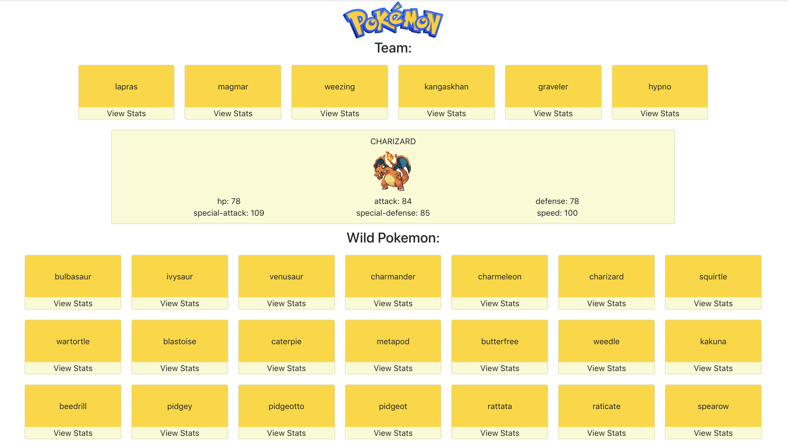

# React Project Planning Practice

Imagine you are a free lance software developer, and you've accepted a job from a client who needs your help to build a React application. They send you the following information:

>I want to start playing competitive Pokemon battling, so I need this app to help me plan and build out my Pokemon team. Here are the user stories: As a user, I should see a bunch of Pokemon cards on the page. As a user, I should be able to see the stats of any one Pokemon. As a user, I should be able to add Pokemon to and remove Pokemon from my team. Here's a mock-up of what I envision:

You're super excited about this opportunity! That is, until you realize this is all they have provided you with... This is hardly enough information!

### Exercise 0 - Research
If you're not familiar with Pokemon, take a minute to read this explanation from Nintendo, the company beside the franchise:

> Pokémon are creatures of all shapes and sizes who live in the wild or alongside humans. There are currently more than 700 creatures that inhabit the Pokémon universe.

> Pokémon are raised and commanded by their owners (called “Trainers”). During their adventures, Pokémon grow, level up and become more experienced and even, on occasion, evolve into stronger Pokémon.

> There are over a dozen different types of Pokémon, such as Fire type, Psychic type, and Dragon type. Every Pokémon type comes with both advantages as well as disadvantages when battling different Pokémon types.

> For instance, a Fire type Pokémon has the edge against Grass type Pokémon, but will be at a disadvantage against Water type Pokémon. This makes strategic thinking, positioning and use of the Pokémon in your team a crucial part of battles.

#### For the following exercises, write down your answers and thoughts. We will need them for lecture.

## Exercise 1 - Ask Questions

As a developer, you'll be working with people to understand and bring software to life, so asking the right questions is a good skill to develop. Your client hasn't told you how a Pokemon is added to a team or what validations the app should have!

Brainstorm a list of follow up questions to ask you client. Remember, you should understand this app inside and out before you begin building it.

## Exercise 2 - Plan out the Component Hierarchy

Refer back to the mock-up of the application. What React components will you need to create? Write out the entire Component Hierarchy for this app.

## Exercise 3 - Design State

What state will you need to build out this application? And where should each piece of state live?

## Exercise 4 - Recommendations and Extra Features

Brainstorm a list of additional features you could build out for this app. Remember, sometimes your clients may not know exactly what they want. 

